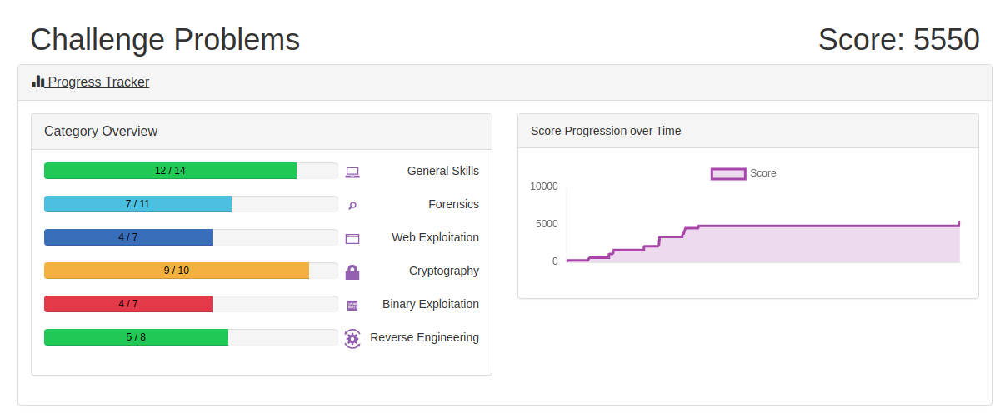

# PicoCTF 2019

This one is geared to middle/high schoolers.  Mainly it's to get an understanding of how CTF's work and to have fun. Using it to work out the kinks of writeups and documenting.

In the end work/life stopped me from continued effort.  

Site: [https://2019game.picoctf.com/](https://2019game.picoctf.com/)

1. [The Factory's Secret](factory_secret.md)
1. [Insp3ct0r](inspector.md)
1. [The numbers... what do they mean?](numbers.md)
1. [Warmed Up](warmed_up.md)
1. [Unzip](unzip.md)
1. [Like1000](like1000.md)
1. [dont-use-client-side](dont-use-client-side.md)
1. [2Warm](2Warm.md)
1. [vault-door-training](vault-door-training.md)
1. [13](13.md)
1. [First Grep](first_grep.md)
1. [Resources](resources.md)
1. [Practice Run 1](practice-run-1.md)
1. [Glory of the Garden](glory-of-the-garden.md)
1. [vault-door-1](vault-door-1.md)
1. [vault-door-3](vault-door-3.md)
1. [vault-door-4](vault-door-4.md)
1. [Bases](bases.md)
1. [Strings it](strings_it.md)
1. [What's a net cat?](what_is_netcat.md)
1. [Based](based.md)
1. [Easy1](easy1.md)
1. [Ceaser](ceaser.md)
1. [Where are the robots?](where_are_the_robots.md)
1. [So meta](so_meta.md)
1. [Flags](flags.md)
1. [Plumbing](plumbing.md)
1. [First Grep: Part II](grep_part_ii.md)
1. [Where is the file?](where_is_the_file.md)
1. [What lies within](what_lies_within.md)
1. [Extensions](extensions.md)
1. [Shark on the wire 1](shark-on-the-wire-1.md)
1. [Picobrowser](picobrowser.md)
1. [Tapping](tapping.md)
1. [Waves Over Lambda](waves_over_lambda.md)
1. [Handy-shellcode](handy-shellcode.md)
1. [OverFlow 0](overflow-0.md)
1. [Mr Worldwide](mr-worldwide.md)
1. [La Cifra De](la-cifra-de.md)
1. [Vault-door-5](vault-door-5.md)
>>>>>>> 8f98a51bc9e6ca3bb9a91a1dd68c3c86e856774b
